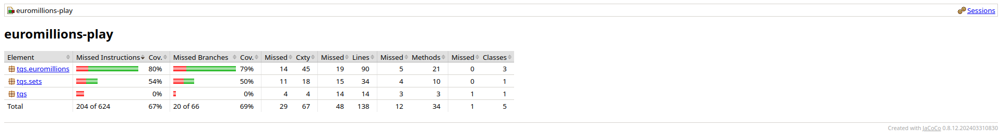
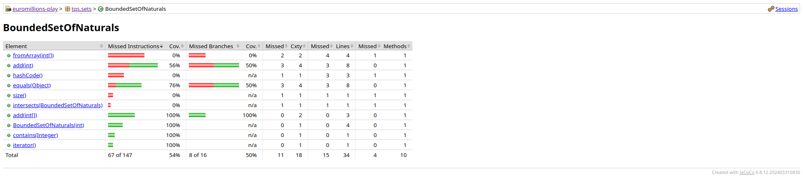
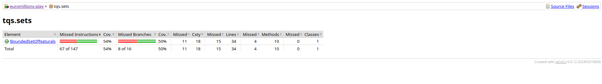
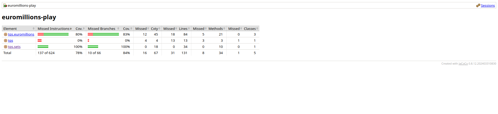
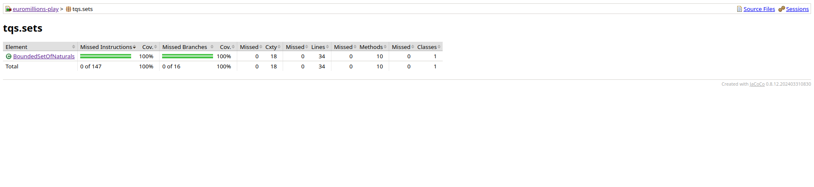
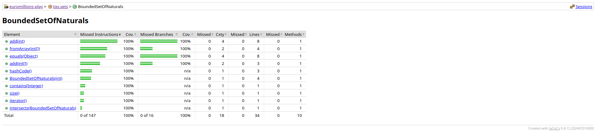
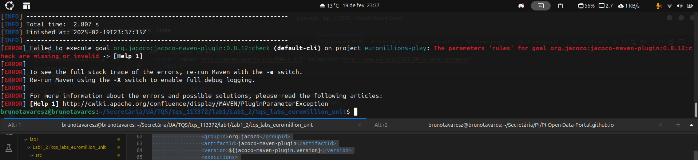

# 1 Lab

### 1.1 Simple Stack Contract

#### Passo a Passo

1. **Criação do Projeto Maven com Dependências do JUnit 5**
   - Ao criar o projeto Maven, incluir as dependências do JUnit 5 no arquivo `pom.xml`
     - `junit-jupiter`
     - `maven-surefire-plugin`

   **Comando Maven para rodar os testes**:
   ```bash
   mvn test
   ```

   Este comando executa os testes definidos no seu projeto e garante que o JUnit 5 esteja corretamente configurado.

2. **Cobertura de Código**
   - JaCoCo para medir a cobertura de código:
   ```bash
   mvn clean test jacoco:report
   ```

   - O relatório gerado estará disponível na pasta `target/site/jacoco` em formato HTML.

#### 1.2 EuroMillions

1. **Analisar a Cobertura de Código com JaCoCo**
   - Configurar o projeto Maven para usar JaCoCo para análise de cobertura de código.

   - **Comando para rodar a cobertura de código**:
   ```bash
   mvn clean test jacoco:report
   ```

   
   
    
    
    
    

   - **Comando para verificar a cobertura e falhar caso o limite não seja atingido**:
   ```bash
   mvn clean test jacoco:check
   ```
   



