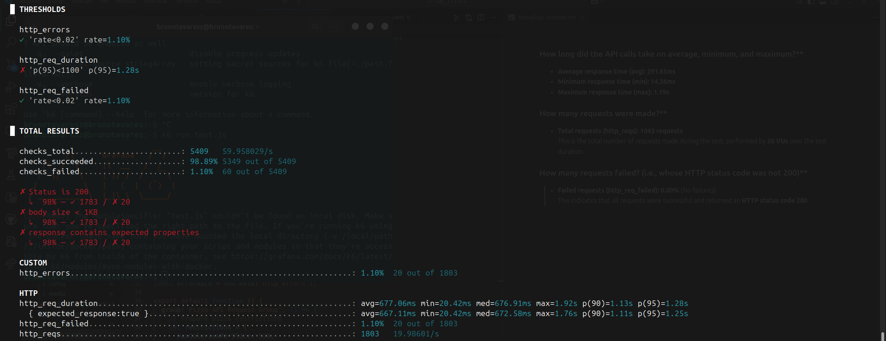
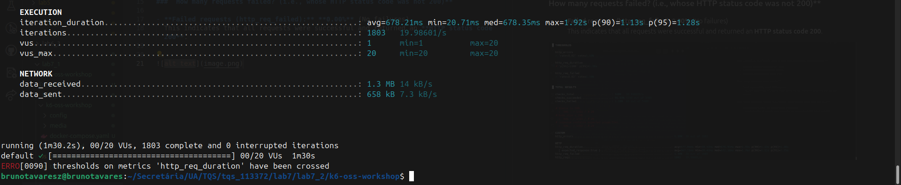
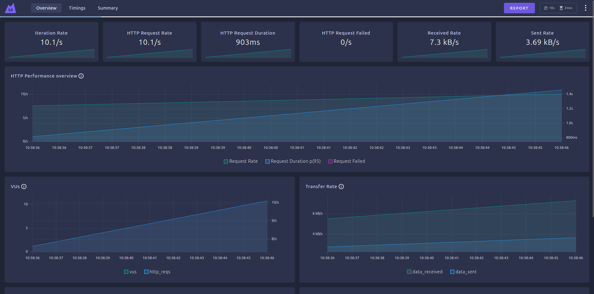
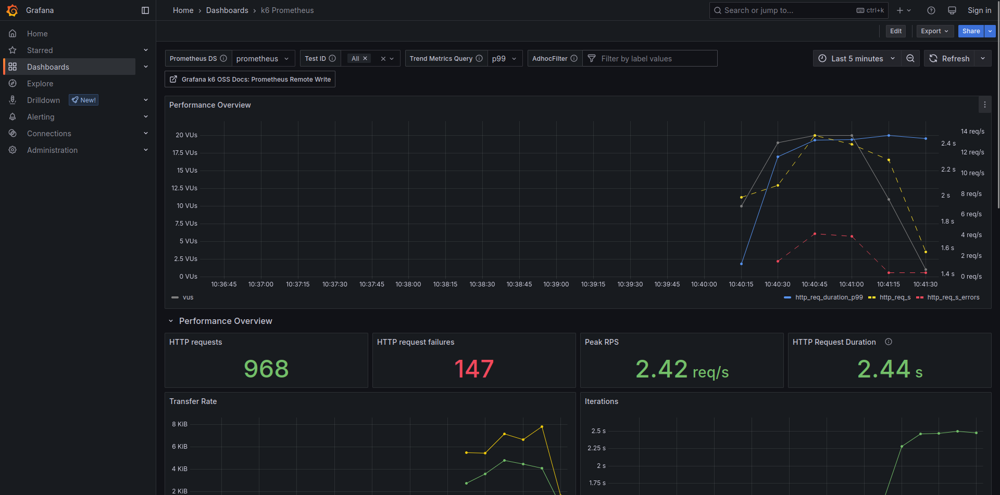

### How long did the API calls take on average, minimum, and maximum?**

- **Average response time (avg):** **291.65ms**
- **Minimum response time (min):** **14.36ms**
- **Maximum response time (max):** **1.19s**

###  How many requests were made?**

- **Total requests (http_reqs):** **1043 requests**  
  This is the total number of requests made during the test, performed by **20 VUs** over the test duration.

###  How many requests failed? (i.e., whose HTTP status code was not 200)**

- **Failed requests (http_req_failed):** **0.00%** (No failures)  
  This indicates that all requests were successful and returned an **HTTP status code 200**.

